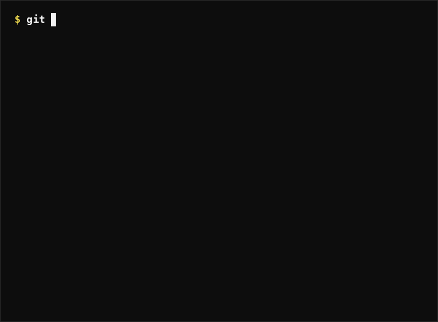

  

  

---

## About Me

I'm a Computer Engineering student with a focus on web development and blockchain applications. My work spans full-stack development — from building responsive front-end interfaces to designing back-end architectures and integrating blockchain-based solutions.

I'm continually expanding my skill set, exploring new frameworks and tools, and applying what I learn to real-world projects. I value clean, maintainable code and enjoy solving technical problems that require both creativity and precision.

---

## Tech Stack

**Languages**

  &nbsp;
  &nbsp;
  &nbsp;
  &nbsp;
  &nbsp;
  &nbsp;

**Frameworks & Libraries**

  &nbsp;
  &nbsp;
  &nbsp;
  &nbsp;
  &nbsp;
  &nbsp;
  &nbsp;
  &nbsp;
  &nbsp;

**Databases**

  &nbsp;
  &nbsp;

**Tools & Platforms**

  &nbsp;
  &nbsp;
  &nbsp;
  &nbsp;

---

## GitHub Statistics

  <table>
    <tr>
      <td></td>
      <td></td>
    </tr>
  </table>

  

---

Thank you for visiting my profile.

